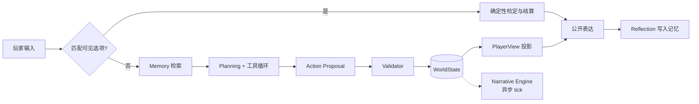

# AI Native RPG

[](https://github.com/zhang-manyi/AI_Native_RPG/actions/workflows/ci.yml)
[](https://www.python.org/)
[](https://github.com/astral-sh/ruff)

一个面向 AI Native 游戏的 NPC Agent 系统：LLM 驱动的 NPC 运行时，建立在确定性世界状态层之上，配套 Trace 与 Eval 闭环。

场景是一起村庄失踪案。玩家通过关键选项或自由对话调查，三名 NPC 在人设与关系约束下决定说什么、隐瞒什么；线索随信任、恐惧和调查进度逐步解锁，最终提交报告进入 7 种结局之一。

## 亮点

- **完整的 NPC Agent 链路**：Memory 检索 → Planning（含 Function Calling 工具循环）→ Action Proposal → Validator → 公开表达 → Reflection 写回记忆。每一步都写入 Trace。
- **LLM 不能直接改世界**：所有状态变更必须经过 `Action Proposal → Validator → State Update`。这由代码强制：`WorldState` 私有，读取返回深拷贝。
- **信息不对称用数据 + 纯函数实现**：`Fact.visibility` + 结构化 `reveal_condition` + `PlayerView` 投影，不需要额外的 LLM 调用，也不需要 `eval()`。
- **私有推理与公开台词隔离**：NPC 的规划可以读私密记忆和人设，但生成台词的那次调用只看裁决后的 `PlayerView` 和结构化行动结果。这个边界来自一次真实演示中发现的泄密，修复过程和前后实录都有保留。
- **叙事引擎**：5 个叙事算子（伏笔、揭示、升级、反转，以及记录安静回合的缓和）、伏笔账本、节奏规则，在 Web 端异步运行，不阻塞玩家等待。当前剧本中算子标注在作者写好的事件上，模型不能自行编造新伏笔。
- **评测驱动迭代**：7 组离线/真实模型实验，覆盖记忆检索、多轮记忆使用、证据表达、工具决策、隐私披露。每组都记录分母、缺失、成本和是否采用，失败的候选同样保留。
- **工程质量**：969 个测试全部离线运行（mock LLM，零网络请求），CI 跑 ruff + pytest。

## 架构

核心设计原则：**按是否需要 LLM 分层，而不是按功能分层。**

| 层 | 内容 | 特征 |
|---|---|---|
| Deterministic | 世界状态、Validator、信息投影、事件检定、排序 | 纯代码，可单测，延迟 <10ms |
| Agent | 记忆检索、规划、工具调用、台词生成、反思 | 依赖 LLM，输出不确定，靠 Eval 约束 |
| Observability | Trace、叙事面板、Eval | 消费前两层的产出，不在主流程 |



几个关键取舍：

- **Action 校验在生成台词之前。** 否则台词已经说出口而行动被拒，玩家听到的与世界状态不一致，且无法回滚。
- **关键剧情走确定性结算，LLM 只负责演绎。** 选项点击先检定、应用结果，再让 NPC 用台词演绎；模型表达失败时用作者写的固定回复兜底，不撤销结果。
- **工具只读。** NPC 有 3 个工具（`query_relationship`、`query_memory`、`check_public_fact`），写操作只能以 proposal 形式提出，由 Validator 的规则列表裁决。
- **剧本与代码分离。** 世界、人设、事件、结局全部在 `scenarios/<name>/world.yaml`，加载时做交叉引用校验，换剧本不改代码。

## 评测

详细结果见 [evals/OVERVIEW.md](evals/OVERVIEW.md)。各实验题目和分母不同，不合并成总分。

| 实验 | 关键结果 | 决定 |
|---|---|---|
| 记忆检索（48 问，开发/留出各半） | 留出集 Recall@3：Hashing 32.5% → Qwen3-Embedding 92.5%；MRR 0.371 → 0.854 | Qwen 作为可选后端 |
| 多轮记忆使用 | 召回 18/18，但答案正确只有 6/18 | 说明检索成功不等于回答正确，推动后续表达实验 |
| 受限证据表达 | 留出普通答案 7/12 → 12/12，但完成率与依据质量不足 | 不推广 |
| 工具决策与短任务 | 候选任务成功率 15/18 → 13/18 | 保留基线 |
| 行动后证据交接 | 开发集答案 4/9 → 9/9，但披露率上升 | 默认关闭 |
| 公开表达边界（真实整局） | 两条路线均到达 `truth_uncovered`；16 条台词未观察到未授权披露 | 设为真实 Web/终端默认路径 |

方法上的约定：开发集选候选，留出集只做最终验证；真实模型条件重复 3 次；失败样本、wire 级请求记录和当次源码快照随报告归档。语义判定目前由助手复核，没有独立人工校准，样本规模也有限，这些限制在各份报告里写明。

真实演示的失败与修复是一个完整案例：[失败实录](evals/reports/2026-09-18-demo-acceptance/review.md)中，NPC 的私有规划在一次仅调整关系的行动后把未公开情节说了出来；Trace 给出了完整因果链，[修复后复核](evals/reports/2026-09-18-public-expression/review.md)用同一路线和事先冻结的变体验证。

## 快速开始

```bash
uv venv && uv pip install -e ".[dev,web]"
uv run pytest                          # 全部测试，不需要 API key
```

运行 Web 界面：

```bash
uv run python scripts/web.py --mock    # 离线，无需 key
cp .env.example .env                   # 填入 DEEPSEEK_API_KEY（或任意 OpenAI 兼容端点）
uv run python scripts/web.py           # http://127.0.0.1:8000
```

页面包含场景对白、关键选项、自由对话，以及右侧的开发者面板（Trace、伏笔账本、线索解锁进度）。不用自由输入也能走完整个调查，点击路线见 [docs/16](docs/16_Guided_Playthrough.md)。`--no-dev` 只保留玩家视图。

> 服务没有鉴权，只绑定 loopback。`/debug/*` 会暴露完整世界状态（含真相），不要对外暴露。

终端版：`python scripts/chat_demo.py [--mock] [--npc npc_b]`，每回合打印完整决策链。

可选语义检索：安装 `.[embedding]` 或设置 `EMBEDDING_MODEL_PATH` 指向 Qwen3-Embedding GGUF，未安装时自动回退到 `HashingEmbedder`。

## 目录

```
src/ai_native_rpg/
├── schemas/        Pydantic 数据模型（唯一事实源）
├── world/          World State Manager：条件求值、Validator、PlayerView、唯一写入口
├── scenario.py     剧本包加载与交叉引用校验
├── llm/            LLMClient 协议 + OpenAI 兼容客户端 / Mock
├── agent/          NPC Agent 运行时：harness、工具、记忆、表达、embedding
├── narrative/      叙事引擎：触发规则、张力控制、事件结算、结局
├── observability/  Trace 落盘、面板
├── *_evaluation.py 各实验的评分逻辑
└── web/            FastAPI + SSE，玩家接口与开发者接口隔离

prompts/            运行时 prompt 模板
scenarios/          剧本内容（YAML）
scripts/            Web/终端入口、评测与验收脚本
evals/              题库、实验报告与原始证据
docs/               设计文档
```

## 设计文档

| 文档 | 内容 |
|---|---|
| [01 System Architecture](docs/01_System_Architecture.md) | 分层原则与模块职责 |
| [02 Sequence Diagram](docs/02_Sequence_Diagram.md) | 一次交互的时序、LLM 调用点、延迟预算 |
| [04 World State Manager](docs/04_World_State_Manager.md) | 事实源、Validator、信息不对称 |
| [05 Narrative Engine](docs/05_Narrative_Engine.md) | 触发规则、LLM 生成、Experience Controller |
| [06 NPC Agent Spec](docs/06_NPC_Agent_Spec.md) | Memory / Planning / Tool Use / Dialogue / Harness |
| [07 Observability](docs/07_Observability.md) | Trace、叙事面板、数据回流 |
| [08 Evaluation](docs/08_Evaluation.md) | 评测维度设计 |
| [10 Narrative Operators](docs/10_Narrative_Operators.md) | 叙事算子、伏笔账本、张力与偏好分离 |
| [12 Web Interface](docs/12_Web_Interface.md) | SSE 事件流、叙事 tick 异步化 |
| [14 Case Design](docs/14_Case_Design.md) | 失踪案的线索、人物与结局设计 |
| [16 Guided Playthrough](docs/16_Guided_Playthrough.md) | 当前可玩范围、交互约定、验收路线 |

其余文档（03 玩家模型、09 参考场景、11 Prompt Lab、13/15 事件编排）记录了早期设计，部分内容尚未落地。
